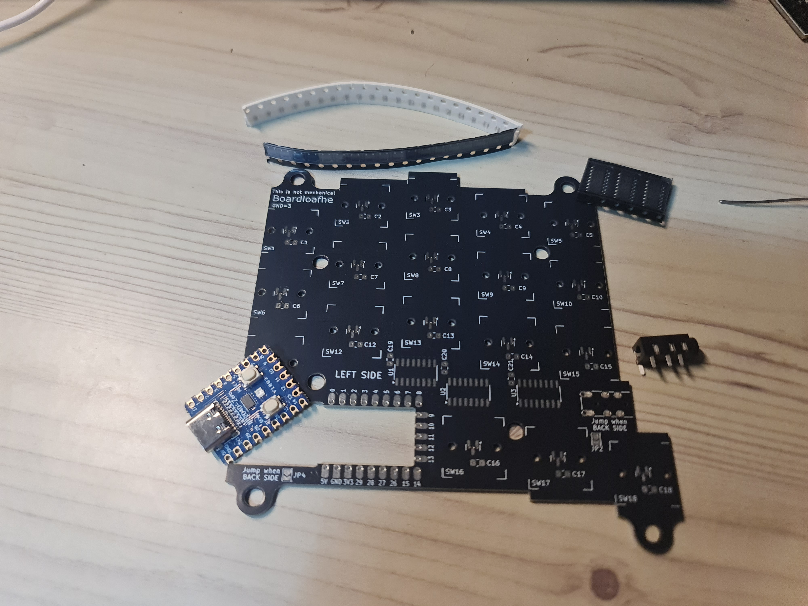
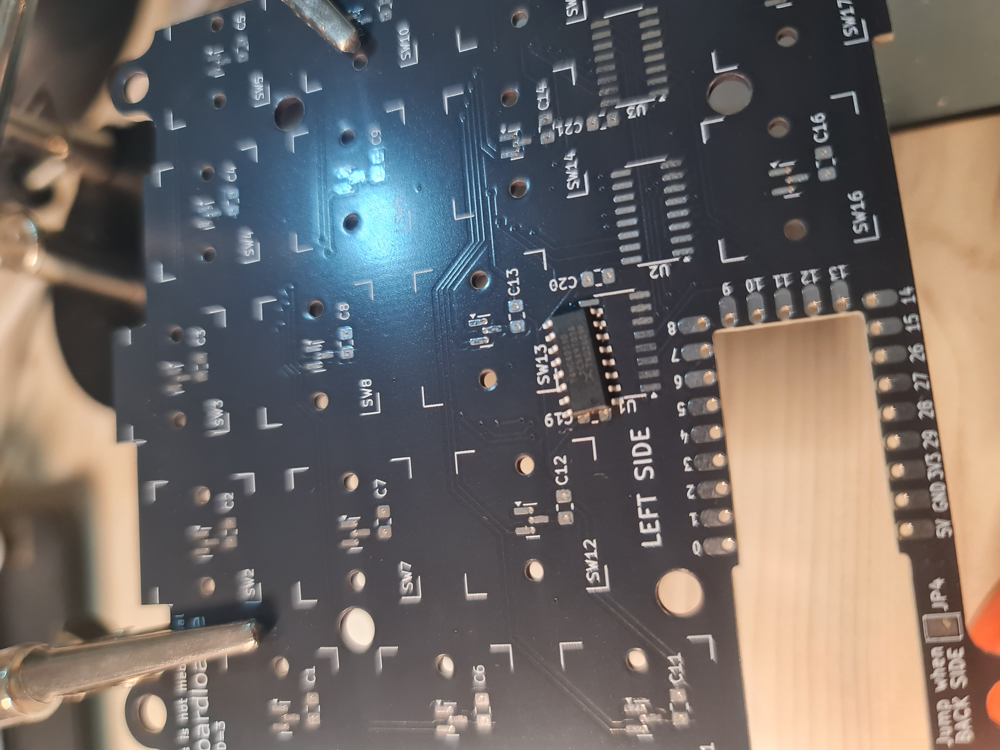
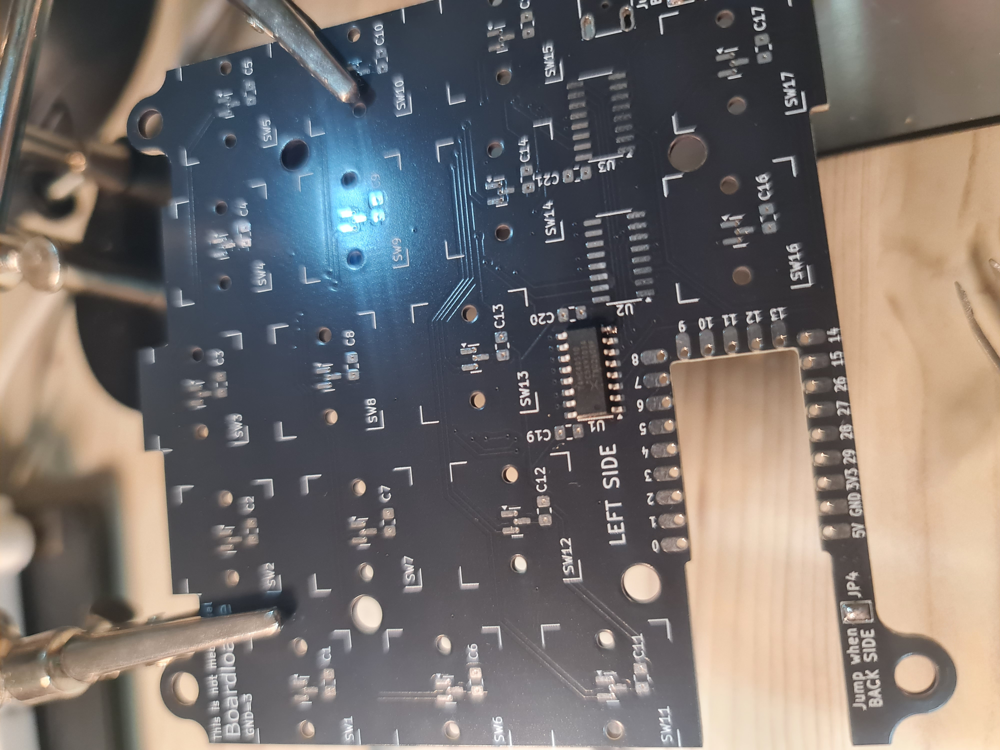
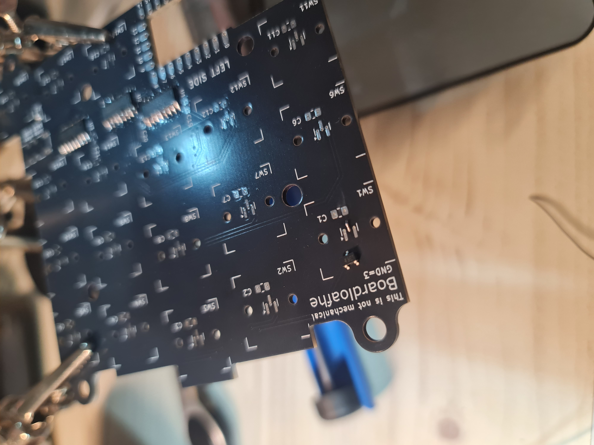
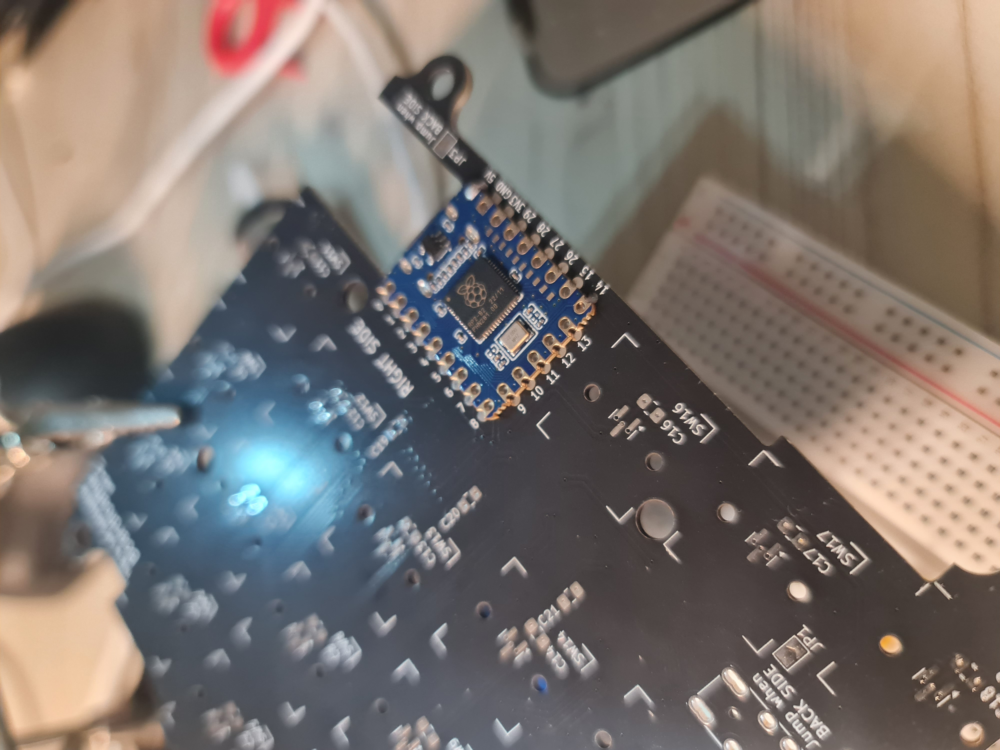
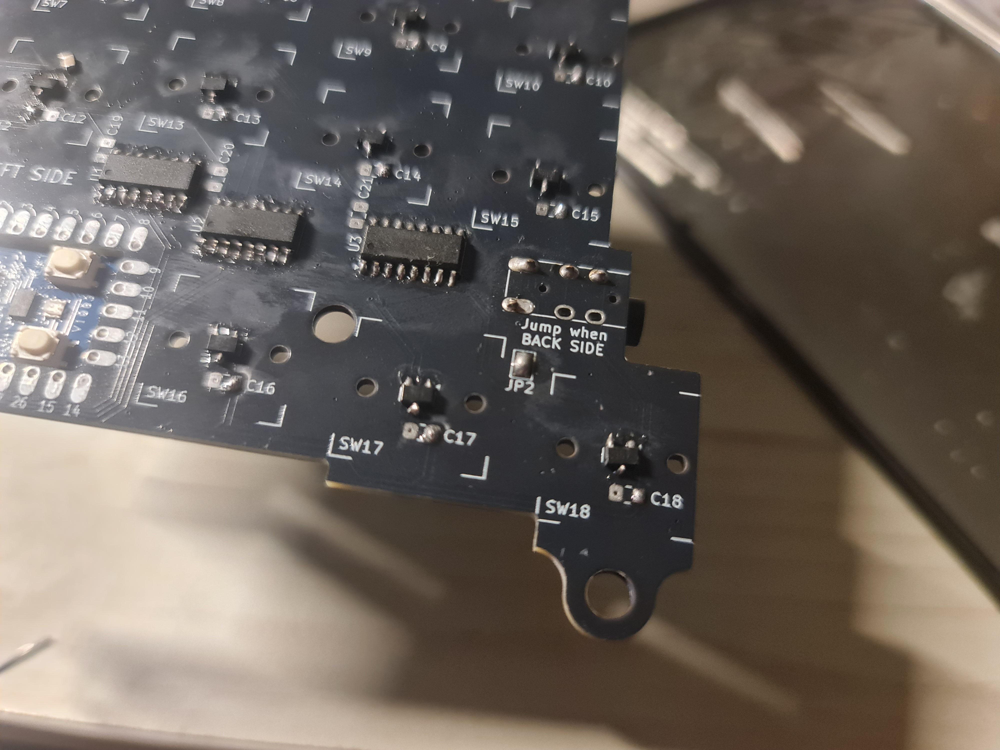
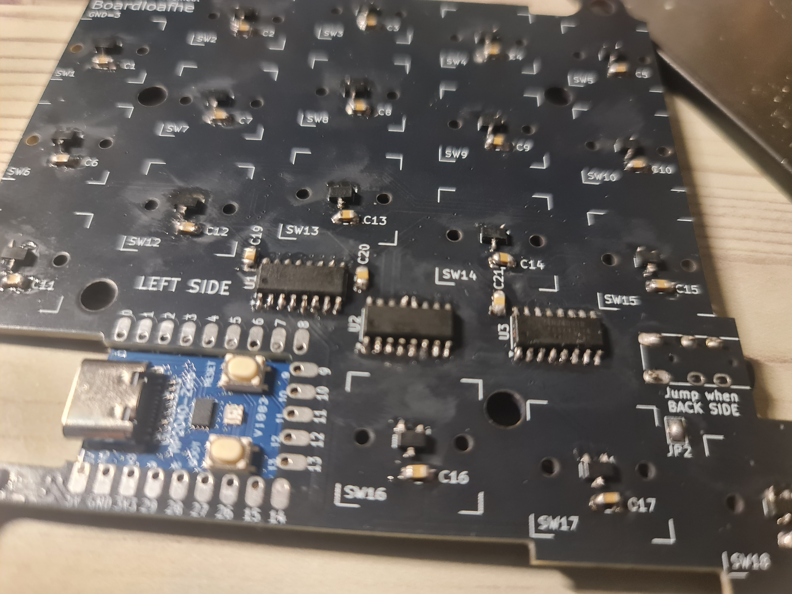
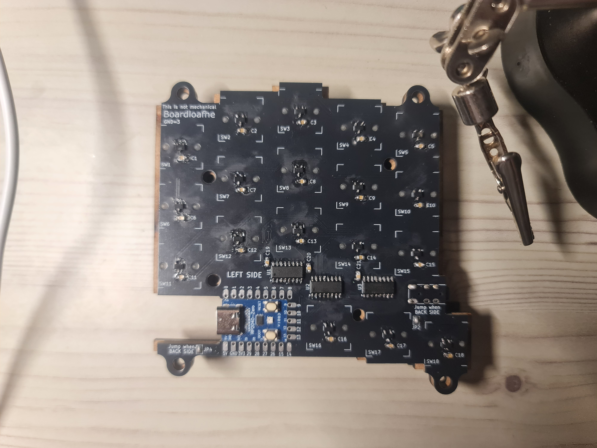
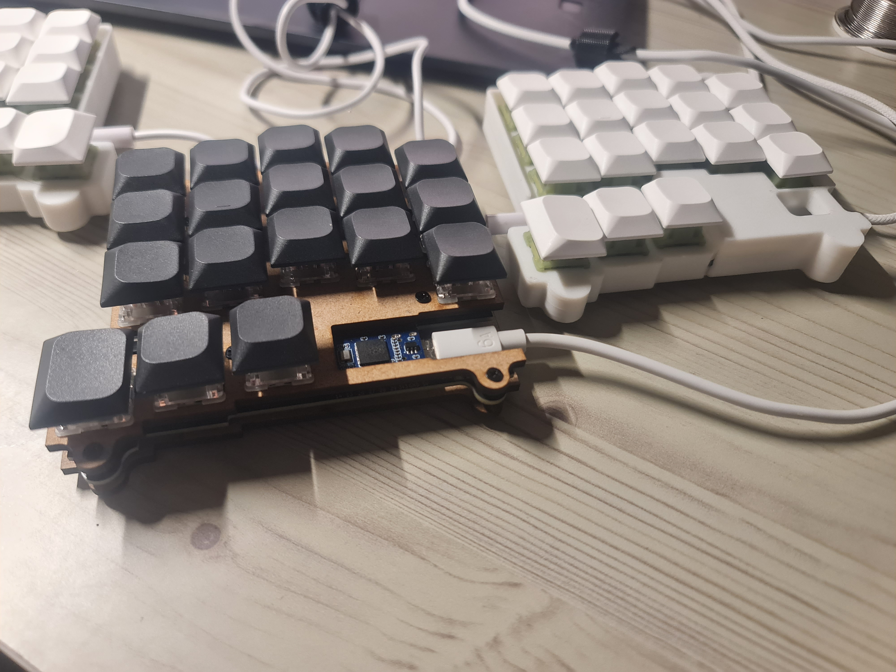

# Build guide

Also check out: [Modubu build guide](https://github.com/yuburoll/modubu/blob/main/documents/buildGuide_ko.md) (RP2040 Zero soldering, in Korean)

### Preparation

For each half, make sure you have:
- PCB
- RP2040 Zero
- PJ320A TRRS 3.5mm Socket
- SOIC-16 74HC4051 x 3
- SOT-23 SS49E x 36
- 0805 0.1uf capacitor x 42
  - actually optional

Recommended soldering order:
1. 74HC4051
2. SS49E
3. RP2040 Zero
4. PJ320A
5. capacitor

All jumpers: at the back

### 74HC4051
Ensure that the circle mark matches the arrow mark on the PCB!

As many build guides suggested, apply solder on one of the solder mask, then push the component towards solder while it's molten.

Then you may solder the rest. PCB is reversible, but the multiplexor can only lie on single plane.

### SS49E

Like the multiplexor, apply solder on one of the solder mask - I recommend the middle one. Push it, and finish soldering other pins. Just in case, ensure that your sensor has the same pinout as PCB! (it probably will).

### RP2040 Zero

Solder in SMD manner, ensuure that the pin number matches the PCB.

USB-C port will be almost on the same plane with the PCB.

Recommendataion: solder one corner or more. Then solder the rest.

### PJ320A
*Just do it*

### Capacitor

Capacitors are to prevent voltage shocks... or so I heard. The keyboard should work properly without it, but let's play safe.

It has no direction.

Like others, apply solder, push, and pull.

### Complete
Then it looks like this.

Left is mdf sandwich version, and right is Yuburoll's original Boardloaf, with 3d printed case.

