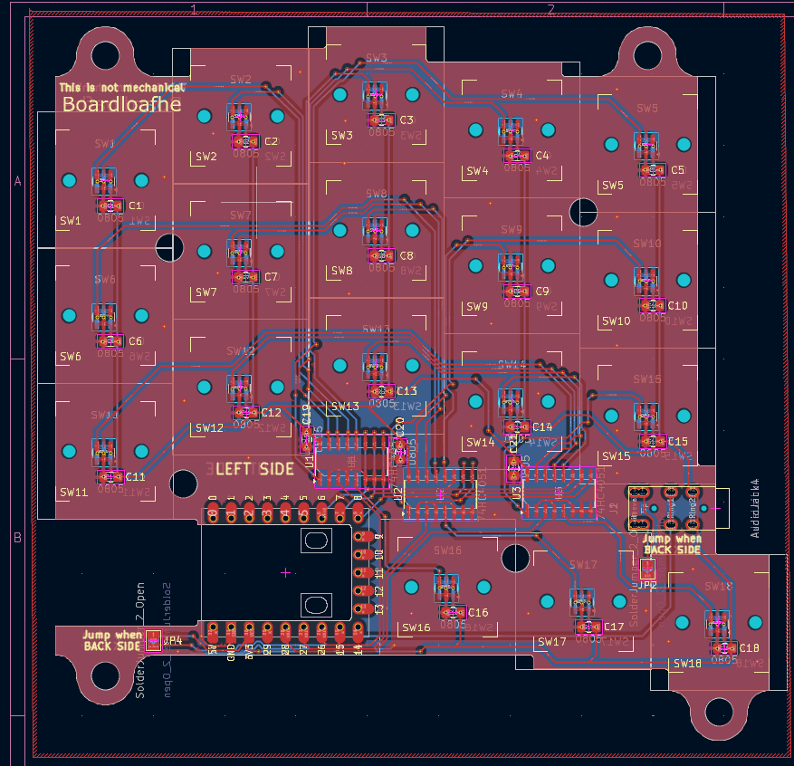

# Boardloaf-HE

[Some image to be inserted]

Hall-effect variant of [Yuburoll's Boardloaf](https://github.com/yuburoll/Boardloaf), a 36-key split keyboard.

Wooting compatible, reversible, under 100mm pcb with qmk/vial support.

Based on Boardloaf and strongly inspired by [TrueStrike42](https://github.com/byungyoonc/TrueStrike42)

## Preparation
- Pricing: PCB based on JLCPCB / components based on Taobao (shipping to South Korea)
- Shipping fee not included, but PCB can be shipped with $1.5 option and Taobao delivery fee is acceptable for price gap
- Assumes you only want to build one (which makes cost higher)

### Board
| Component            | Qty | Price/unit          | Price |
| -------------------- | --- | ------------------- | ----- |
| PCB                  | 2   | $2/5 pcs            | $2    |
| SOT-23 SS49E         | 36  | ¥0.31/1 pc ~= $0.05 | $2    |
| SOIC-16 74HC4051(D)  | 6   | ¥0.74/1 pc ~= $0.11 | $0.7  |
| 0805 0.1uf capacitor | 42  | ¥2.5/50 pcs ~= $0.4 | $0.4  |
| PJ320A TRRS socket   | 2   | ¥8/100 pcs ~= $1.2  | $1.2  |
| RP2040 Zero          | 2   | ¥7.3/1 pc ~= $1.1   | $2.2  |
- For capacitor, 0.1~1uf should be fine
- And obviously, USB-C cable of your choice (with machine) and TRS/TRRS cable of your choice
- Board cost: $9 or more

### Case
- Option A: 3D printed case (from yuburoll's repo)
- Option B: Cheap plate cut
  - requires heat insert and standoff
  - 3T mdf panel of A4 size can fit 2x top & bottom plate
      - and costs about $1

| Component                  | Qty | Price/unit            | Price |
| -------------------------- | --- | --------------------- | ----- |
| M2 screw 6mm               | 16  | ¥4/500 pcs ~= $0.6    | $0.6  |
| M2 heat insert 3*3         | 16  | ¥4.9/100 pcs ~= $0.7  | $0.7  |
| M2 standoff 7mm + 3mm head | 16  | ¥2.31/50 pcs ~= $0.35 | $0.35 |
- Flathead screw was used
- Standoff can be shorter or longer - but I recommend 5mm at least
- Case cost: $3 or more

### Switches
| Component                          | Qty | Price/unit         | Price |
| ---------------------------------- | --- | ------------------ | ----- |
| Wooting compatible magnetic switch | 36  | ¥36/40 pcs ~= $5.3 | $5.3  |
- I personally chose Everglide Sticky Rice, as it was the cheapest I could find.
- While those without side pins should be fine, I'd use one with side pins so that they fix better
- Firmware fix may be required to use the opposite polarity
- Switch cost: $6 or more

With these things combined, you can get your own HE keyboard in about $12 excluding cables and switches.

## [Build guide](GUIDE.md)

## Features
- Supports both APC and rapid trigger
- Cheap, simple, and working
- 3 multiplexor on each side, scanning 6 keys per mux

## Improvements to be done
- [ ] Support analog mousekey
- [ ] Switch to full duplex / TRRS communication
- [ ] Make SOT-23 pad larger, thus easier to solder
- [ ] ~~Switch to blackpill mcu for better ADC (not in this repo)~~

## Remarks
- Documentation
  - Further documentation in progress
  - Plate KiCad file to be uploaded
  - Images to be added
- Case
  - PCB outline and holes are the same as original Boardloaf, thus all housing are compatible
  - I used cheap 3T mdf for housing, with bumpons. Works fine for me
- Random
  - PCB schematics are almost directly from TrueStrike42
  - If your board does not work, it's likely soldering issue. Try cleaning the board well and solder again
  - I think it's a good start on implementing random idea for HE keyboard

## Licenses
MIT license for all the code
CC BY-SA 4.0 license for all hardware / design: inherited from Boardloaf

## Disclaimer
Webapp and firmware were vibe coded.
I checked it working, but will double check.
